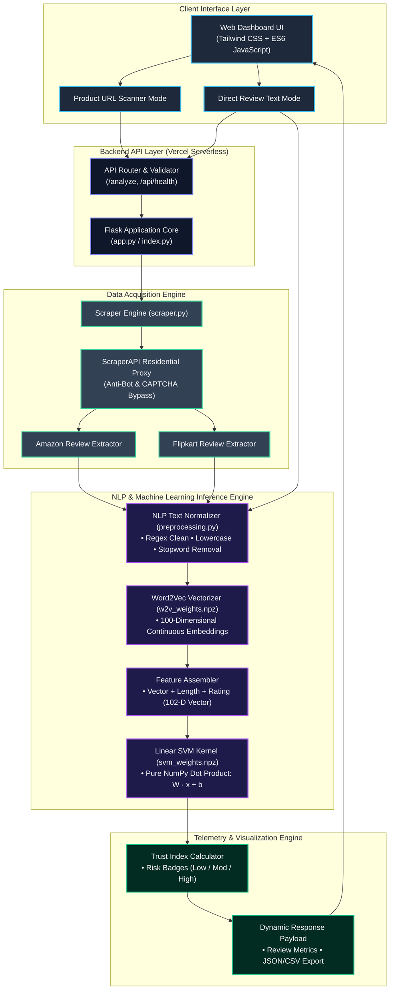
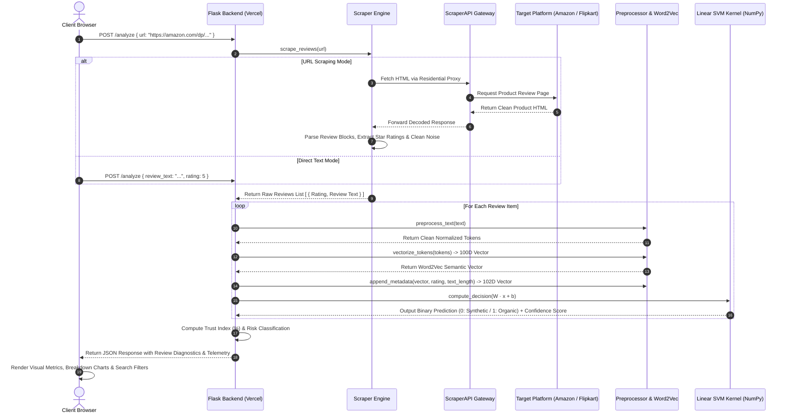

# SENTINEL - E-Commerce Review Integrity & Synthetic Manipulation Detection Engine

> Production-ready Machine Learning and NLP system that audits live e-commerce reviews (Amazon, Flipkart, Shopify) in real time, generates 100-dimensional semantic embeddings, and detects computer-generated and synthetic review manipulation using a high-speed Linear SVM decision boundary.

[](https://senitel-drab.vercel.app)
[](https://www.python.org/)
[](https://flask.palletsprojects.com/)
[](https://numpy.org/)
[](LICENSE)

Live Application: [https://senitel-drab.vercel.app](https://senitel-drab.vercel.app)

---

## Overview

SENTINEL is an engineering-first review verification platform built to combat the proliferation of AI-generated, bot-fabricated, and coordinated promotional consumer reviews.

Unlike conventional heuristic or keyword-based approaches, Sentinel couples **dynamic proxy scraping** with **100-dimensional continuous Word2Vec semantic embeddings** and a **Linear Support Vector Machine (SVM)** mathematical decision kernel. The inference layer is executed entirely in pure NumPy linear algebra, delivering sub-millisecond execution times and minimal memory footprint on serverless environments.

---

## UML System Architecture

### 1. Component Architecture Diagram



---

### 2. Sequence Flow Diagram



---

## Core Features

- **Live Multi-Platform Scraping:**
  - **Amazon Engine:** Direct ASIN extraction, canonical URL resolution, and automated review body parsing.
  - **Flipkart Engine:** Dynamic review extraction with structured fallback parsers.
  - **Residential Proxy Integration:** Compatible with ScraperAPI for automated WAF, CAPTCHA, and datacenter IP block resolution on cloud environments.
  - **Direct Review Text Auditor:** Audit custom or offline review passages with arbitrary star ratings.

- **High-Speed Pure NumPy Inference:**
  - Compact pre-computed weight matrices (`svm_weights.npz` and `w2v_weights.npz`).
  - Pure linear algebra decision kernel ($y = W \cdot x + b$) without heavy runtime frameworks.
  - Sub-millisecond inference time and serverless bundle footprint under 20MB.

- **Telemetry Dashboard:**
  - Real-time **Trust Index (%)** computation.
  - Classification into **Organic (OR)** vs. **Synthetic / Computer-Generated (CG)**.
  - Interactive search and filter controls.
  - Export capabilities for **JSON telemetry** and **CSV datasets**.

---

## Tech Stack

| Component | Technologies |
|---|---|
| **Live Deployment** | Vercel Serverless Functions |
| **Backend & API** | Python 3.12, Flask, Werkzeug |
| **Inference Kernel** | Pure NumPy Linear Algebra ($W \cdot x + b$) |
| **NLP & Embeddings** | Word2Vec Vector Space (100-D), NLTK |
| **Scraping & Proxy** | Requests, BeautifulSoup4, ScraperAPI Gateway |
| **Frontend UI** | HTML5, Tailwind CSS, ES6 JavaScript, Plus Jakarta Sans, JetBrains Mono |

---

## Local Development Setup

### 1. Clone the Repository
```bash
git clone https://github.com/AviralNITW/Senitel.git
cd Senitel
```

### 2. Create Virtual Environment
```bash
# Windows
python -m venv venv
venv\Scripts\activate

# macOS / Linux
python -m venv venv
source venv/bin/activate
```

### 3. Install Dependencies
```bash
pip install -r requirements.txt
```

### 4. Configure Environment Variables (Optional)
Create a `.env` file or export your ScraperAPI key for cloud-level proxy scraping:
```bash
# Windows PowerShell
$env:SCRAPER_API_KEY="your_api_key_here"

# Linux / macOS
export SCRAPER_API_KEY="your_api_key_here"
```

### 5. Launch the Server
```bash
python app.py
```

Access the dashboard at: **`http://localhost:5001`**

---

## Production Deployment (Vercel)

1. Push your repository to GitHub.
2. Import the project in [Vercel Dashboard](https://vercel.com/dashboard).
3. In **Settings -> Environment Variables**, add:
   - `SCRAPER_API_KEY`: *(Your ScraperAPI Key)*
4. Deploy the project. The serverless configuration in `index.py` and `requirements.txt` runs out of the box.

---

## Author

**Aviral**  
- GitHub: [@AviralNITW](https://github.com/AviralNITW)  
- Live Application: [https://senitel-drab.vercel.app](https://senitel-drab.vercel.app)

---

## License

This project is licensed under the [MIT License](LICENSE).
